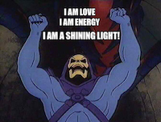
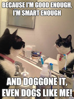

# affirmation-generator

This is the team project repository for the Affimation Generator REST service

---

###**Problem Statement**
With an increase of screen time it's harder to get positive affirmations from the 
people who physically surround you in  life. The positive affirmation generator is a tool to get a 
healthy dose of self-confidence and motivation in your life though the screens we love in an effort ot create the positive support one needs to succeed in all areas of life. You can do it!

###**Project Objectives**
*Must Haves*
* Search for an affirmation by category or popularity
* Up vote or down vote affirmations
* Add your own affirmations to the db

*Nice to Haves*
* Personalize your affirmation
* Generate a random affirmation (choose naughty or nice!)

###**Project Plan**

Deadline | Project Goals
----- | -----
10/18/16 | Create project repo, create a readme.md, add first entries to journal.md, create class diagram for project, ERD
10/25/16 | Create basic project structure and configuration in IntelliJ, create REST shell, create db and tables
11/1/16 | Create DAO's, write corresponding tests, successfully make API request for all end points
11/8/16 | Documentation, tests and logs.
11/15/16 |  present our project

---
### Project Documents / References
- [Team Journal](TeamJournal.md )
- [Slate: Documentation Template System](https://github.com/lord/slate)
*Slate helps you create beautiful, intelligent, responsive API documentation.*

---

 
